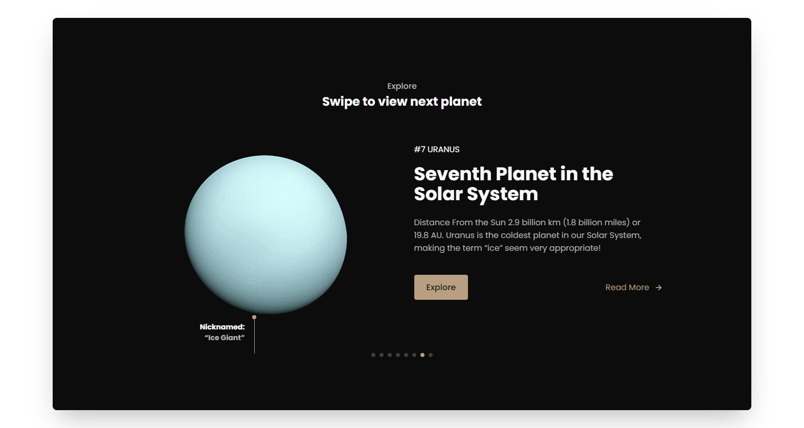
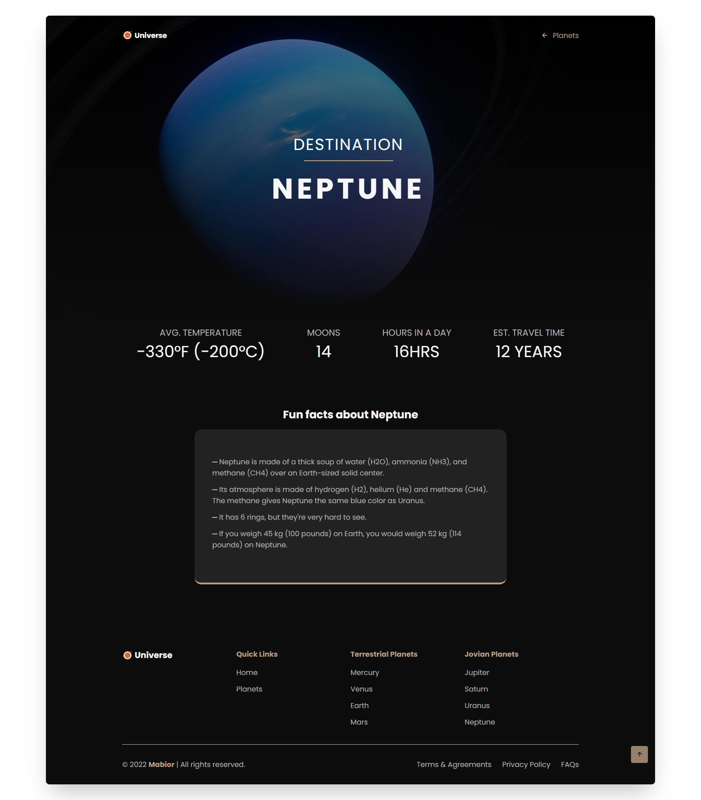

  
  
  
  
  
  
  <h2 align="center">Universe - Website Concept about the Universe & Solar System</h2>

  Built for educational purposes from my interest in the Universe, enjoy exploring.

  <a href="https://universeglance.netlify.app/"><strong>➥ Live Demo</strong></a>

### Preview

### Overview
- Developed using Mobile First Approach.
- Compatible with all devices.
- SEO optimized
- Contains reveal-on-scroll animations.

### Tools Used
- Icons: https://boxicons.com/
- Images: https://www.pexels.com/
- Images: https://nineplanets.org/
- Information: https://nineplanets.org/
- Information: https://solarsystem.nasa.gov/
- Information: https://www.asc-csa.gc.ca/eng/astronomy/
- Information: https://spaceplace.nasa.gov/

### Built With
- HTML5
- CSS3
- Javascript

### Source Code
- These are just the starter files, complete source code is on my private repo
